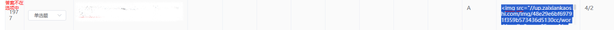

# E Learning Question Exporter

This repository contains the scripts for exporting question bank from the skill level tournament PDF files

[中文文档](README.md)

## Dependencies

Please install the dependencies using the following command:

```bash
python -m pip install -r requirements.txt
```

## Usage

### Modify `main.py`

* Modify the `TARGET_CONFIG` item in `main.py` to the name of the configuration file in the `config` folder (without the `.json` suffix).
* Modify the `OUTPUT_TYPE` item in `main.py` to the export file method. Currently, two methods are supported: `OutputExcel2KaoShiBao` and `OutputWord2KaoShiBao`, corresponding to the two import templates for the `KaoShiBao` software.

### Run

Run `main.py`.

```bash
python main.py
```

The exported files will be saved in the `output` folder and named according to the `title` item in the `config` file.

## Configuration

### Creating Configuration Files

For information on creating configuration files, refer to the [README.md](config/README.EN.md) in the `config` folder.

### Code Configuration
#### PDF Parsing

There are two libraries for parsing `PDF` files:
* `pymupdf` (`fitz`): Provides comprehensive parsing, including image parsing, suitable for files without images.
* `tika`: Java-based parsing, supports text-only parsing.

These correspond to the `ProcessViaTika` and `ProcessViaFitz` classes, respectively. You can find their implementations in `process/base_process.py`.

By default, the `ProcessViaFitz` class is used to support image parsing.

#### Export

There are two types of export file formats:

* `OutputExcel2KaoShiBao`: Exports to the `KaoShiBao` software's `Excel` template, accurate parsing but does not support images.
* `OutputWord2KaoShiBao`: Exports to the `KaoShiBao` software's `Word` template. Due to Word's formatting issues, parsing may be inaccurate and require manual adjustment during question bank upload, but it supports image upload.

Choose as needed and modify the `OUTPUT_TYPE` item in `main.py` to switch.

## Known Issues

1. Exported `Word` templates with image-only options may encounter parsing errors during question bank upload, such as:
   
   In this case, manually copy the image file to the corresponding option box on the question bank import page.
2. Due to the `KaoShiBao` software's parsing issues with `Word` templates, exported `Word` templates may have parsing errors, such as option misalignment. This requires manual adjustment.
   For example:
   ```html
    1. 以下关于装置的说法，正确的是（ ）
    A. 会产生10A的交流电
    B. 会产生100A的交流电
    C. 会产生1000A的交流电
   ```
   When imported into `KaoShiBao`, it may misinterpret the options as:
   ```html
    1. 以下关于装置的说法，正确的是（ ）
    A. 会产生10
    B. 的交流电
    C. 会产生100
    D. 的交流电
    E. 会产生1000
    F. 的交流电
   ```
   This issue is caused by the software platform and cannot be automatically resolved, requiring manual adjustment.

## Others

Feel free to submit PRs and suggestions, and report any issues.